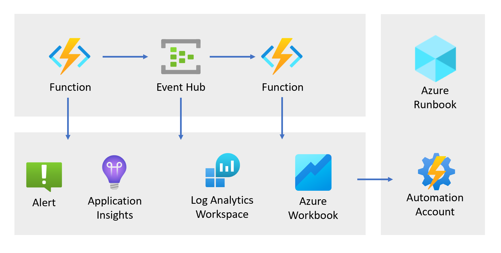

# Introduction

This solution shows how you can utilize standard Azure services to monitor a solution perform common maintenance actions. It implements a working solution and deployment is automated as well.

The goal of this showcase is to demonstrate the capabilities and to provide a playground to tinker with it. It can help to learn how to use these concepts.

To understand the concepts of the showcase, please check out [this show case description](docs/Showcase.md). As a next step you can check [the list of components](docs/Components.md). 

NOTE: The sample code can also be used with Databricks. To connect Databricks to Log Analytics, check out this repository: [https://github.com/Azure-Samples/databricks-observability](https://github.com/Azure-Samples/databricks-observability) 

## Disclaimer

THE SOFTWARE IS PROVIDED "AS IS", WITHOUT WARRANTY OF ANY KIND, EXPRESS OR IMPLIED, INCLUDING BUT NOT LIMITED TO THE WARRANTIES OF MERCHANTABILITY, FITNESS FOR A PARTICULAR PURPOSE AND NONINFRINGEMENT. IN NO EVENT SHALL THE AUTHORS OR COPYRIGHT HOLDERS BE LIABLE FOR ANY CLAIM, DAMAGES OR OTHER LIABILITY, WHETHER IN AN ACTION OF CONTRACT, TORT OR OTHERWISE, ARISING FROM, OUT OF OR IN CONNECTION WITH THE SOFTWARE OR THE USE OR OTHER DEALINGS IN THE SOFTWARE.

## Credits

The Azure Automation part is based on this setup: [https://github.com/jordanbean-msft/automation-ado](https://github.com/jordanbean-msft/automation-ado)
