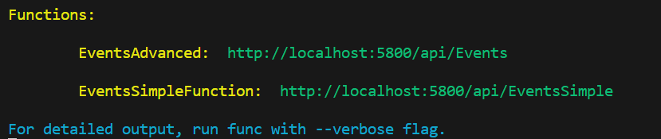

# Events function

The function does not have actual business logic, it is just an empty shell that implements only emits the logging and metrics that such a service should emit.

## Local development

Configure your local local development environment to run the Azure functions. The workspace is setup as multi-root, meaning it is configured to support debugging more than one Function at te same time.

1. Install the [prerequisites for local development](../../README.md).

2. Create a local.settings.json file in the EventsFunction directory. Make sure to copy the 2 connection strings from the Events app after it is deployed to Azure.

    ```json
    {
        "IsEncrypted": false,
        "Values": {
            "FUNCTIONS_WORKER_RUNTIME": "python",
            "AzureWebJobsStorage": "UseDevelopmentStorage=true",
            "OTEL_SERVICE_NAME": "Events (local)",
            "APPLICATIONINSIGHTS_CONNECTION_STRING": "<copy from config of Event function in Azure>",
            "EVENTHUB_CONNECTION_STRING": "<copy from config of Event function in Azure>"
        }
    }
    ```

3. Create a Python Virtual Environment for this function:
    * Press F1
    * Python: Create environment
    * Choose Venv - create a virtual environment directory .venv
    * Choose the Tasks Function
    * Choose Python 3.11
    * Dependencies to install: choose the Requirements.txt file
    And confirm with OK so that it would be the follow

4. Start the local Azure emulator.

    You may need to configure the location where Azurite stores its files. I configured it to c:\temp\azurite in my setup. You can configure this in the settings of the Azurite plugin. By default it will store its files in the root of the workspace. Those files are excluded from Git and in .vscode\settings.json

    Then press F1 and type **Azurite: start**

5. You can now run the Azure function on your local system by opening Run & Debug (Ctrl-Shift-D) and clicking Play for the Events function.

This will first install the dependencies from the Requirements.txt file and you should then see the endpoints that are available.

It should show something like:


## Sample requests to get started

You can activate this function using a tool like Postman or the [Thunder Client plugin for VS Code](https://marketplace.visualstudio.com/items?itemName=rangav.vscode-thunder-client).

You can find a collection of requests for the Thunder client in [thunder-client-Sample-Events-collection.json](/thunder-client-Sample-Events-collection.json). It contains a set of requests to run 6 scenarios.

Each request triggers a different behavior in the functions, leading to different log lines. Below you find more details about the options. See also: [Sample http requests](../../docs/Sample_http_requests.md).

The requests use a variable for the baseurl so you can use the same requests to execute the function locally or remote on Azure.

First define a new environment and add the baseurl variable. Configure it to point to the right host, like:
    [http://localhost:5800](http://localhost:5800)

The Events function will return a message indicating if it succeeded or failed. In case of success  (e.g. scenario 1) it returns status code 200 and a message with the (fake) number of events processed:

```
Completed processing 129 events
```

In case of an error (e.g. scenario 6) you will get:

```
Events failed.
```

## Limitation: must use older version opentelemetry package

This sample uses an older version of the open telemetry libraries because in December 2023, using version 1.22.0 raised an error:

```
AttributeError: type object 'ResourceAttribute' has no attribute 'PROCESS_PARENT_PID' 
```

To avoid this we must use an older version of the azure-monitor-opentelemetry package, which depends on opentelemetry version that does not yet use Resource Detectors.

* azure-monitor-opentelemetry==1.0.0b15
* opentelemetry-sdk==1.19.0
* opentelemetry-api==1.19.0
