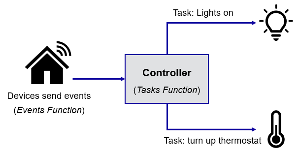

# Showcase

This repo is a showcase of how to produce logs and metrics (OpenTelemery), how to analyze it (Log Analytics) and respond to it (Azure Automate).

This serves as a mental model to understand the role of each service:

* Events: simulates an IoT event producing events.
* Tasks: simulates a Controller handling the events to perform some Task

Both Functions contain no actual business logic and are just meant to create telemetry data to analyze.

The Events function can fail, simulating a situation such as a device crash or no connectivity. Then no event will be sent to the Event Hub.

The Tasks function also fail but has a retry feature, so if fails to switch the light on, it will try at most 2 more times. Those (1, 2 or 3) attempts are considered to be 1 batch. So if a batch succeeds, the light is on. In the telemetry you can see the iterations, which can serve as a leading indicator for problems.

Here is [collection of sample scenarios](SampleScenarios.md) for you can run and explore. Each of them creates telemetry data that you can then explore in Log Analytics.